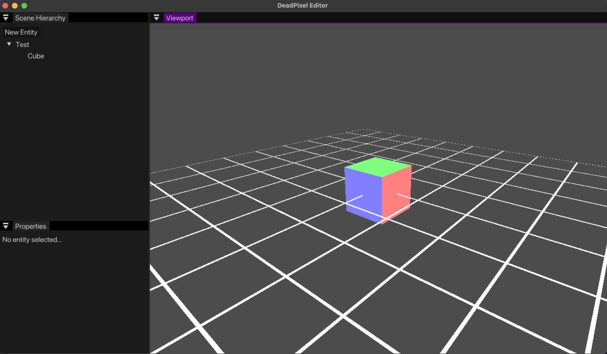

# dead pixel
This is just a game engine I'm making to learn about how the various
components of modern games actually work.

## Latest Screenshot

## ToDo
- [X] Basic window
- [X] Event system
- [X] VAOs, VBOs, and IBOs
- [X] Entity System (basic)
- [X] Textures (stb-image)
- [X] Shaders
- [X] Basic Editor UI
- [ ] glTF 2.0 parsing
- [ ] Gizmos and ~~Gridlines~~
- [ ] Jump Flood Algorithm (editor outlines)
- [ ] Lighting
- [ ] Shadows
